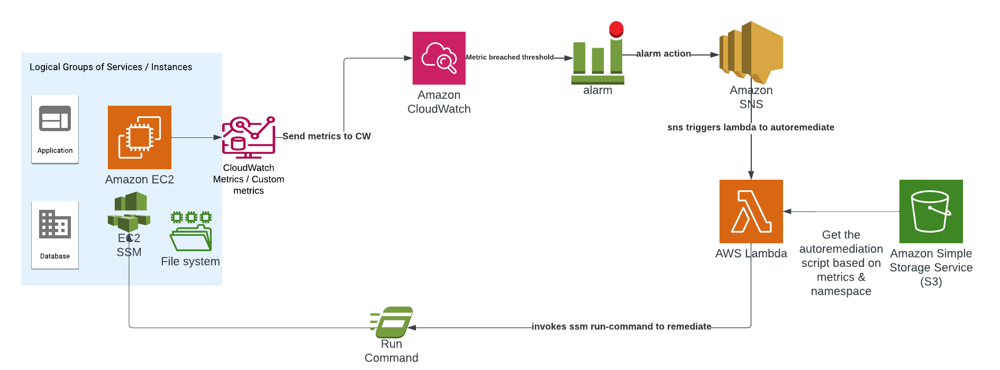

#  Incident auto-remediation in AWS

In an extensive infrastructure, managing incidents efficiently is often difficult. Nobody likes to wake up at night to attend to an incident. As part of SysOps / DevOps / Administrator, it is important to keep improving the system so that one can understand the incident patterns, its behaviour, the cause of the incident and its resolution. In one of our client infrastructures, we have a very big, diverse set of applications/services deployed in AWS. Managing that infrastructure at scale sometimes becomes tedious. In this blog post, we will discuss managing the incident automatically using event-driven architecture and AWS box features customization to resolve those incidents. Let's jump into it.

**Incident occurrence & predicting its nature**: AWS EC2 machines offer compute capability to host any kind of workload, for example deploying an application (frontend/backend), any proprietary software or even acting as a bastion host. It offers a wide range of varieties with flexibility. So anything deployed in these virtual machines requires monitoring. Hence, it is important to install the AWS CloudWatch agent in those VMs and to generate custom metrics based on the KPI of those installed services, for example, availability, performance etc. AWS provides several ways to create/send metrics to cloud watch and then create cloud watch alarms accordingly. (Left a link in the description below, for your reference on cloud watch agent and metrics). Based on the incident patterns (from the incident management / ITSM tool), an incident repository could be built and analyzed, in order to prevent this incident from occurring, as well as build remediation solutions as well.


**Example use case:** In one of our AWS accounts, several EC2 VMs have been used to host backend jobs for applications, applications, databases like couchebase, data visualization software like tableau etc. as incidents can be for anything and every possible event. For the sake of simplicity, I would like to articulate how these things can be dealt with, for a simple application.


An application is written in Python flask in an EC2 deployed via nginx to port 80. It is deployed as a "webapp" service in systemd and it will be monitored by a script to check if a webapp service is available or not, and every minute it will send metrics to CloudWatch. The namespace is "CustomNamespace" and the metric name is "webapp-uptime". The script is set up in cron.d as a cronjob.
The chosen EC2 VM is Amazon Linux, where by default AWS CLI and SSM agent is installed. AWS CLI command is used to send metrics to CloudWatch. 

Command:

```bash
 aws cloudwatch put-metric-data \
    --metric-name "webapp-uptime" \
    --dimensions InstanceId=$INSTANCE_ID \
    --namespace $NAMESPACE \
    --value $count \
    --region $REGION
```

In order to make the system work, the ec2 instance role to have a put-metric-data on CloudWatch as well as to receive SSM instruction from System Manager. 

To setup the application and monitoring system, ansible-playbook is used. You can find code in the playbook folder.

The application setup is done by the ansible task:

```yaml
- name: setup application on ec2 amazon linux vm
  include_tasks: setup-application.yaml
```

The monitoring setup is done by the ansible task:

```yaml
- name: setup monitoring on ec2 amazon linux vm
  include_tasks: setup-monitoring.yaml
```

Once the playbook finishes, you can verify the application is running, using the following command:

```shell
 curl http://<private-ip-of-ec2>
```

You will have a response
>Sample webapp!

You can verify from the CloudWatch, metrics section, namespace is **CustomNamespace** and metric name is **webapp-uptime**.


**Auto remediation system**

The system works as follows:
1. In EC2, the python application runs as a systemd service and is exposed via nginx, corn job monitors application availability and sends metrics every minute.
2. If the service is stopped, the application does not work any longer, and metrics will send the value as 0, which will breach the threshold value of the alarm, it will trigger an SNS topic which will trigger a lambda function.
3. The lambda function will retrieve the configuration script to remediate the incident, from S3 bucket. The file name of the script: <metricname>#<namespace>.sh. Here it is webapp-uptime#CustomNamespace.sh. The script has a command to launch the systemd service.
4. The script content is retrieved and sent to the specific EC2 instance where the application is installed and executes the script.
5. As soon as the action takes place, the application launches and metric sent by the monitoring script reaches the OK condition and Alarm is marked as resolved.
The workflow is presented below:



This process can work efficiently even for SysOps activity like Disk resizing, throughput changes, or even Windows Server as well, which were being tested. This a small demo, to show how it can work. 

This process can be leveraged in the following way:
1. The SSM output can also be stored in the S3 bucket, to verify the sanity of the operation and to improve further.

2. Retry mechanism can be put in place with a pause, if:
  a. SSM fails.  b. Alarm does not come back to OK state.
3. If auto-remediation failed or the corresponding configuration is not found in S3 to remediate the incident, it can open an incident to an ITSM tool or Slack, PagerDuty, Ops Genie etc.


In order to automate the process, you can find the terraform script below, which does following things:

 1. Provisions CloudWatch alarm & SNS, as an action the alarm.
 2. Provisions a Lambda function, in Python, with it's IAM policy and roles.
 3. Attach the SNS topic with the Lambda function.
 4. Provision a S3 Storage bucket and upload remediation config for the lambda to perform task.

Code is in the **terraform** folder within the git repository.


In order to test the system, please perform following activity:

 1. ssh to the EC2 instance.
 2. Execute the command:
  ```shell
   sudo systemctl stop webapp
  ```
 3. Wait for a minute to trigger the alarm automatically.
 4. As soon alarm triggered, check the lambda logs, to verify auto remediation triggered.
 5. It should happen in few seconds and you will have service immediately launched.
 6. If service is remediated, then you can verify the status of the alarm from the console.

The source code available here: [GitHub](https://github.com/arindam-b/aws-series-incident-autoremediation.git)


Thank you, for reading the article.

Some useful links as a reference for the reader:
 1. [SSM & Its setup in EC2](https://docs.aws.amazon.com/systems-manager/latest/userguide/ssm-agent.html)

 2. [CloudWatch metrics](https://docs.aws.amazon.com/AmazonCloudWatch/latest/monitoring/working_with_metrics.html)

 3. [CloudWatch alarms](https://docs.aws.amazon.com/AmazonCloudWatch/latest/monitoring/AlarmThatSendsEmail.html)

